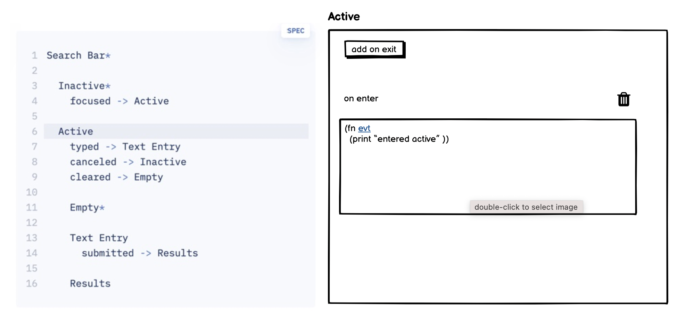

# Architecture

## Persistence

In Datascript we just store the state. Through the property name we can infer what state machine should interpret it

```clojure
{:completion-state {:_state :pending}}
```

For that state machines have to be registered for example like this

```clojure
(register-machine :completion-state {...})
```

## Integration with Datascript

Parallel states should be decomposable. Two parallel states are by definition independent of each other. For example we
could model a todo with two indepedent state machines like this.

```clojure
{:id         1
 :completion {:_state :pending}
 :view-mode  {:_state :read}}
```

The benefit is that we could reuse the view-mode for other things that are not todos but can be edited.

We could implement a helper function that allows us to send events to an entity like this. All events have to be
prefixed by the name of the property that the event should be sent to.

```clojure
(transact-fsm! conn 1 :completion.toggle)
```

Nested states on the other hand are not independent. Here is an example of a digital lock that can be only changed if
the user is logged in.

```
App
  LoggedIn
    Logout -> LoggedOut
    
    Lock 
      Opened
        Close -> Closed
      Closed
        Open -> Opened
    
  LoggedOut
    LoginIn -> LoggedIn
```

## Reflection

The decomposition of parallel states is less useful than I hoped. If we take the `:todo/view-mode` as an example in the
enter action of the `:editing` state we set the temp value to `:todo/description`. This prohibits the reuse
of `:todo/view-mode` as a generic state for any entity that can be editable. We might solve this problem by introducing
abstract computed properties that

There are some subtle problems with invalid state transitions. If we save a todo by pressing enter a save event gets
triggered this causes a rerender of the view which triggers a blur on the input element because it's removed. The blur
triggers another save event but we are already in the `:viewing` state so the event triggers a warning that it's
invalid.

Conceptually the paradigm of statecharts is nice to reason about but the representation as a clojure map makes it
sometimes cumbersome because you have to remember exactly the schema of the machine definition. It's easy to make
mistakes like writing `:action` instead of `:actions`. Another example of this incidental complexity is when to use posh
vs datascript version of `q` and `pull`.

For a first prototype of an IDE a simpler text syntax like sketch.systems would be nice extended with a side panel that
allows to add actions etc.



The flexibility of text is highlighted when looking at [a demo](https://www.youtube.com/watch?v=wykDyFwr8Lk)
of stately. Even though their editor has many nice editing features the author starts by loosely writing down events in
a text file.

There is some friction with the statechart implementation. I don't like that you have to wrap a function with a
`fsm/update` function if you want to mutate the context. It's also a bit hacky that I pass in the connection and entity
id as properties on the event object. I think these issues can be smoothed over by creating my own wrapper functions in
the right places.

## Template variations

The render from scratch semantics of React have been a huge improvement to create more deterministic behaviour. But I
think the problem is that you still have to compress variations of a component into a single function that consists of
conditional sections to represent the different possible views. The question how to structure the coditionals is
something that a compiler could figure out. The hardcoded coditional sections have two drawbacks. First the structure
has to be refactored sometimes if a new variation is added. Second for more complex views it's difficult to tell at a
single glance what the different variations are: How individual conditional sections are combined. A more transparent
solution would be to always give concrete examples how a view should look like under a specific condition and the
copiler can then generate a unified view functions by diffing the concrete views against the base view. I think the
reason why this approach isn't used is that it requires special editors that are not only textual. This makes it
difficult to implement it just as a part of a framework.

## Diffing based view generation

There is a lot of prior work on diffing trees (https://grfia.dlsi.ua.es/ml/algorithms/references/editsurvey_bille.pdf).
For my purposes it's sufficient to find something simple that's quick to implement as long as it works for the todo
example

**Example**

```clojure
[todo @(p/pull conn '[*] e)
 description (:todo/description todo)
 completion (:todo/completion todo)
 view-mode (:todo/view-mode todo)
 done? (fsm/matches completion :done)
 editing? (fsm/matches)]
```

`default`

```html

<div class="flex flex-row">
  <input type="checkbox">
  <div>{description}</div>
</div>
```

`done?`

```html

<div class="flex flex-row">
  <input type="checkbox" checked>
  <div>{description}</div>
</div>
```

`editing?`


